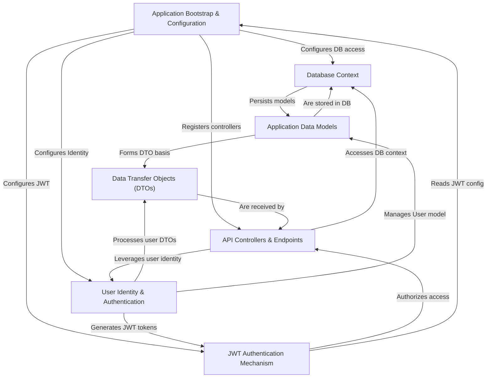

# Tutorial: SimpleCRUD_JWTAuthn

This project, `SimpleCRUD_JWTAuthn`, is a web application that allows users to perform **basic data operations** (Create, Read, Update, Delete) on "items." Its key feature is a robust *user authentication system* where users can register, log in, and then access secured functionalities. After logging in, the system provides a special *JSON Web Token (JWT)*, acting like a digital pass, which users present for subsequent access, ensuring that only authenticated users can manage items or view certain information.

## Visual Overview

## Chapters

1. [User Identity & Authentication
](01_user_identity___authentication_.md)
2. [JWT Authentication Mechanism
](02_jwt_authentication_mechanism_.md)
3. [API Controllers & Endpoints
](03_api_controllers___endpoints_.md)
4. [Data Transfer Objects (DTOs)
](04_data_transfer_objects__dtos__.md)
5. [Application Data Models
](05_application_data_models_.md)
6. [Database Context
](06_database_context_.md)
7. [Application Bootstrap & Configuration
](07_application_bootstrap___configuration_.md)

---

Generated by [AI Codebase Knowledge Builder](https://github.com/The-Pocket/Tutorial-Codebase-Knowledge).
